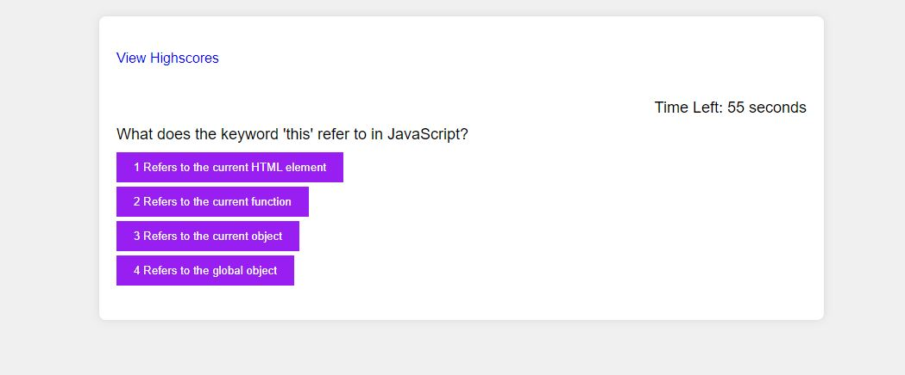

Rework
1 added Live site link
2 added image of  the site 

This Coding Quiz challenges included HTML, CSS and Javascrips
spend most of time on javascripts and put many comments to show my intentions of this app.
on intitial page, I included View Highscores link where users can able to see high scores anytime,
thinking it will help to compare your scores to others. 
There are 4 coding related quiz challenge and 4 possible answers that needs to be anwsered
within 60 seconds, there are penalty of 10 seconds subtraction WHEN user answer a question incorrectly
calculation of grades are based on how many question are correct in %
I put trcking to check how many questions are correct and how many are not
using these variables var correctAnswer, var wrongAnswer 
for example if user got 3 correct answers, it will score as 75% and if user got only 1 correct answer,
he or she will recieve 25% grades.
When user does not answer within time frame, users will get 0% and forced to put Initials (INTITIALS SET TO MAX 5)
I added special time tracking on these 
 to display text content based on answers for 1 second and disappear 

Wrong Answer!

Correct Answer!

It was not required but I thought this application can be presented better with this.
once quiz is done results will show like this.

Correct Answers: 1 Wrong Answers: 3 Your Grades for This Quiz: 25 %. Finished In: 27 Seconds

and user needs to put their Initials, then it saves to local storage with key under 'scores' (initials convert to upper-case)
{
  "initials": "DD",
  "score": 50,
  "finished: 37
}

and after this screen displays previous inputed information with sorted order from high to low 

HighScores
DD: 50% (Completed the Quiz in: 38 seconds left)
DD: 50% (Completed the Quiz in: 37 seconds left)
ER: 25% (Completed the Quiz in: 28 seconds left)
DD: 25% (Completed the Quiz in: 28 seconds left) 

and go back and clear highscores button shows to start over or clear local storeage values
I have reviewed Acceptance Criteria list and everthing looks good.
I spent extra hours adding more functions to enhanced the code as much as I can to make my application presentable.

Live Site Link

https://sagagi74.github.io/Coding_Quiz_Challenge/

